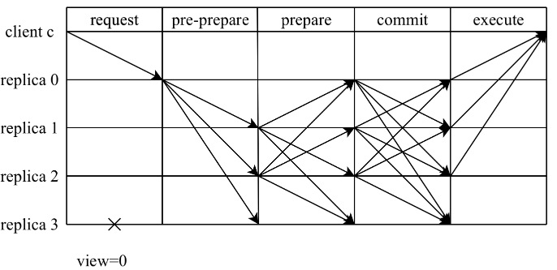
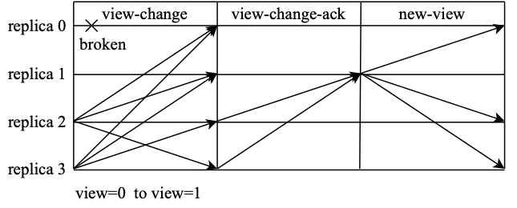

# PBFT

**实用性拜占庭容错算法（Practical Byzantine Fault Tolerance，PBFT）**，是一种在信道可靠的情况下解决拜占庭将军问题的实用方法。拜占庭将军问题最早由Leslie Lamport等人在1982年发表的论文[3]提出，论文中证明了在将军总数n大于3f，背叛者为f或者更少时，忠诚的将军可以达成命令上的一致，即3f+1<=n，算法复杂度为O(n^(f+1))。随后Miguel Castro和Barbara Liskov在1999年发表的论文[1]中首次提出PBFT算法，该算法容错数量也满足3f+1<=n，算法复杂度降低到了O(n^2)。

在理解BFT场景中n、f、Q的关系后，接下来进入到PBFT的介绍。在此之前，简单提一下**SMR（State Machine Replication）复制状态机**[4]。在该模型当中，对于不同的状态机，如果从同样的初始状态出发，按照同样的顺序输入同样的指令集，那么它们得到的最终结果总会一致。对于共识算法而言，其只需要保证“按照同样的顺序输入同样的指令”，即可在各个状态机上获得同样的状态。而PBFT就是对指令执行顺序的共识。

那么，PBFT是如何保证指令执行顺序的一致性呢？PBFT集群为主从结构，由主节点提出提案，并通过集群中各个节点间的交互进行验证，从而使得每个正确节点遵循同样的顺序对指令集进行执行。在这个交互过程中，就需要使用Quorum机制保证集群整体状态的一致性。下面我们将对PBFT进行详细介绍。

## 两阶段共识

相比较常见的“三阶段“概念（pre-preapre、prepare、commit），将PBFT视为一种**两阶段共识协议**或许更能体现每个阶段的目的：提案阶段（pre-prepare与prepare）和提交阶段（commit）。在每个阶段中，各个节点都需要收集来自Q个节点一致的投票后，才会进入到下一个阶段。为了更方便讨论，这里将讨论节点总数为**3f+1**时的场景，此时，读写集票数Q为**2f+1**。

**1) 提案阶段**

在该阶段中，由主节点发送pre-prepare发起共识，由从节点发送prepare对主节点的提案进行确认。主节点在收到客户端的请求后，会主动向其它节点广播pre-prepare消息*<pre-prepare, v, n, D(m)>*

- *v*为当前视图

- *n*为主节点分配的请求序号

- *D(m)*为消息摘要

- *m*为消息本身

从节点在收到pre-prepare消息之后，会对该消息进行合法性验证，若通过验证，那么该节点就会进入pre-prepared状态，表示该请求在从节点处通过合法性验证。否则，从节点会拒绝该请求，并触发视图切换流程。当从接到进入到pre-prepared状态后，会向其它节点广播prepare消息*<prepare, v, n, D(m), i>*，

- *i*为当前节点标识序号

其他节点收到消息后，如果该请求已经在当前节点进入pre-prepared状态，并且收到2f条来自不同节点对应的prepare消息（包含自身），从而进入到prepared状态，提案阶段完成。此时，有2f+1个节点认可将序号n分配给消息m，这就意味着，该共识集群已经将序号n分配给消息m。

**2) 提交阶段**

当请求在当前节点进入prepared状态后，本节点会向其它节点广播commit消息*<commit, v, n, i>*。如果该请求已经在当前节点达到prepared状态，并且收到*2f+1*条来自不同节点对应的commit消息（包含自身)，那么该请求就会进入到committed状态，并可以进行执行。此时，有2f+1个节点已经得知共识集群已经将序号n分配给消息m。执行完毕后，节点会将执行结果反馈给客户端进行后续判断。

## 检查点机制

PBFT共识算法在运行过程中，会产生大量的共识数据，因此需要执行合理的垃圾回收机制，及时清理多余的共识数据。为了达成这个目的，PBFT算法设计了**checkpoint流程**，用于进行垃圾回收。

checkpoint即检查点，这是检查集群是否进入稳定状态的流程。在进行检查时，节点广播checkpoint消息*<checkpoint, n, d, i>*

- *n*为当前请求序号

- *d*为消息执行后获得的摘要

- *i*为当前节点表示

当节点收到来自不同节点的2f+1条有相同*<n,d>*的checkpoint消息后，即可认为，当前集群对于序号n进入了**稳定检查点（stable checkpoint）**。此时，将不再需要stable checkpoint之前的共识数据，可以对其进行清理。不过，如果为了进行垃圾回收而频繁执行checkpoint，那么将会对系统运行带来明显负担。所以，PBFT为checkpoint流程设计了执行间隔，设定每执行k个请求后，节点就主动发起一次checkpoint，来获取最新的stable checkpoint。

除此之外，PBFT引入了**高低水位（high/low watermarks）**的概念，用于辅助进行垃圾回收。在共识进行的过程中，由于节点之间的性能差距，可能会出现节点间运行速率差异过大的情况。部分节点执行的序号可能会领先于其他节点，导致于领先节点的共识数据长时间得不到清理，造成内存占用过大的问题，而高低水位的作用就是对集群整体的运行速率进行限制，从而限制了节点的共识数据大小。

高低水位系统中，低水位记为h，通常指的是最近一次的stable checkpoint对应的高度。高水位记为H，计算方式为H=h+L，L代表了共识缓存数据的最大限度，通常为checkpoint间隔K的整数倍。当节点产生的checkpoint达到到stable checkpoint状态时，节点将更新低水位h。在执行到最高水位H时，如果低水位h没有被更新，节点会暂停执行序号更大的请求，等待其他节点的执行，待低水位h更新后重新开始执行更大序号的请求。

## 视图变更

当主节点超时无响应或者从节点集体认为主节点是问题节点时，就会触发**视图变更（view-change）**。视图变更完成后，视图编号将会加1，随之主节点也会切换到下一个节点。如图所示，节点0发生异常触发视图变更流程，变更完成后，节点1成为新的主节点。

当视图变更发生时，节点会主动进入到新视图v+1中，并广播view-change消息，请求进行主节点切换。此时，共识集群需要保证，在旧视图中已经完成共识的请求能够在新视图中得到保留。因此，在视图变更请求中，一般需要附加部分旧视图中的共识日志，节点广播的请求为*<viewchange, v+1, h, C, P, Q, i>*

- *i*为发送者节点的身份标识

- *v+1*表示请求进入的新视图

- *h*为当前节点最近一次的稳定检查点的高度

- *C*：当前节点已经执行过的检查点的集合，数据按照*<n,d>*的方式进行存储，表示当前节点已经执行过序号为n摘要为d的checkpoint检查，并发送过相应的共识消息。

- *P*：在当前节点已经达成prepared状态的请求的集合，即，当前节点已经针对该请求收到了1条pre-prepare消息与2f条prepare消息。在集合P中，数据按照*<n,d,v>*的方式进行存储，表示在视图*v*中，摘要为*d*序号为*n*的请求已经进入了prepared状态。由于请求已经达成了prepared状态，说明至少有2f+1个节点拥有并且认可该请求，只差commit阶段即可完成一致性确认，因此，在新的视图中，这一部分消息可以直接使用原本的序号，无需分配新序号。

- *Q*：在当前节点已经达成pre-prepared状态的请求的集合，即，当前节点已经针对该请求发送过对应的pre-prepare或prepare消息。在集合Q中，数据同样按照*<n,d,v>*的方式进行存储。由于请求已经进入pre-prepared状态，表示该请求已经被当前节点认可。

但是，视图v+1对应的新主节点P在收到其他节点发送的view-change消息后，无法确认view-change消息是否拜占庭节点发出的，也就无法保证一定使用正确的消息进行决策。PBFT通过view-change-ack消息让所有节点对所有它收到的view-change消息进行检查和确认，然后将确认的结果发送给P。主节点P统计view-change-ack消息，可以辨别哪些view-change是正确的，哪些是拜占庭节点发出的。

节点在对view-change消息进行确认时，会对其中的P、Q集合进行检查，要求集合中的请求消息小于等于视图v，若满足要求，就会发送view-change-ack消息*<viewchange-ack, v+1, i, j, d>*

- *i*为发送ack消息的节点标识

- *j*为要确认的view-change消息的发送者标识

- *d*为要确认的view-change消息的摘要

不同于一般消息的广播，这里不再使用数字签名标识消息的发送方，而是采用会话密钥保证当前节点与主节点通信的可信，从而帮助主节点判定view-change消息的可信性。

新的主节点P维护了一个集合S，用来存放验证正确的view-change消息。当P获取到一条view-change消息以及合计2f-1条对应的view-change-ack消息时，就会将这条view-change消息加入到集合S。当集合S的大小达到2f+1时，证明有足够多的非拜占庭节点发起视图变更。主节点P会按照收到的view-change消息，产生new-view消息并广播，*<new-view, v+1, V, X>*

- *V*：视图变更验证集合，按照<i,d>的方式进行存储，表示节点i发送的view-change消息摘要为d，均与集合S中的消息相对应，其他节点可以使用该集合中的摘要以及节点标识，确认本次视图变更的合法性。

- *X*：包含稳定检查点以及选入新视图的请求。新的主节点P会按照集合中S的view-change消息进行计算，根据其中的C、P、Q集合，确定最大稳定检查点以及需要保留到新视图中的请求，并将其写入集合X中，具体选定过程相对繁琐，如果有兴趣，读者可以参阅原始论文[2]。

# reference

[1] Castro M, Liskov B. Practical Byzantine fault tolerance[C]//OSDI.1999, 99(1999): 173-186.

[2] Castro M, Liskov B. Practical Byzantine fault tolerance andproactive recovery[J]. ACM Transactions on Computer Systems (TOCS), 2002,20(4): 398-461.

[3] Lamport L, Shostak R, Pease M. The Byzantine generals problem[M]//Concurrency: the Works of Leslie Lamport. 2019: 203-226.

[4] Fred B. Schneider. Implementing fault-tolerant services using the state machine approach: A tutorial. ACM Comput. Surv., 22(4):299–319, 1990.
